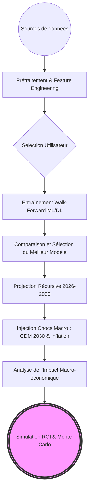
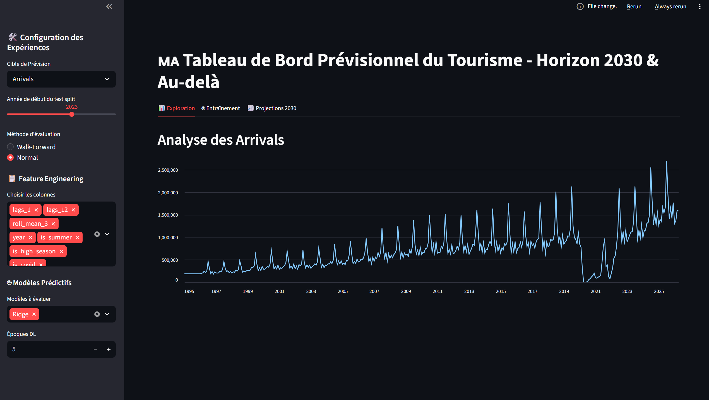
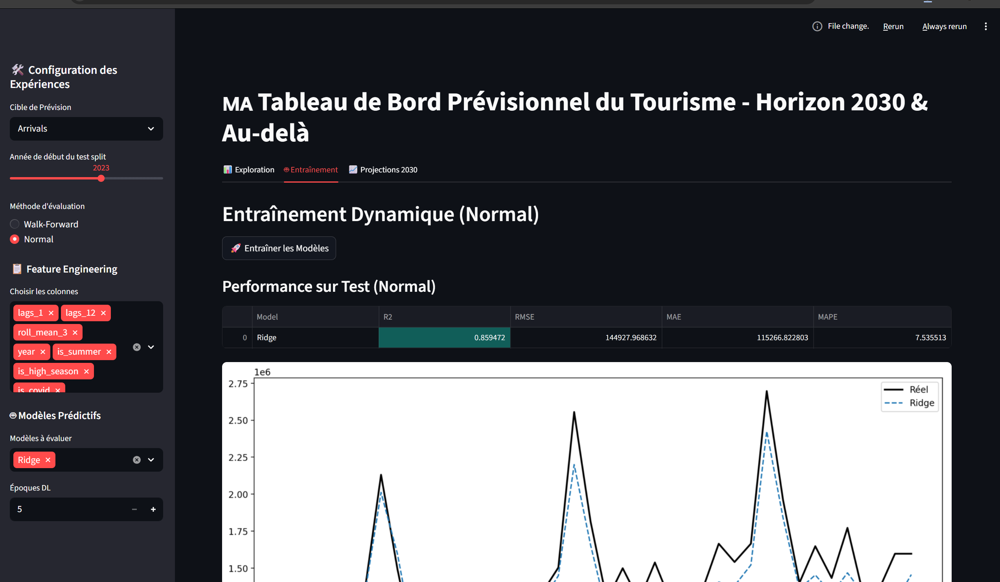

# Documentation Analytique et Stratégique : `dashboard.py`

## Présentation générale

**Rôle du dashboard dans le projet**  
Le module `dashboard.py` constitue l'application interactive centrale (développée via Streamlit) du projet "Stratégie Hôtelière Maroc 2030". Il encapsule l'ensemble du pipeline de modélisation prédictive des séries temporelles (Data Science) sous la forme d'un outil visuel "No-Code" à destination des analystes et décideurs métier.

**Importance dans le système de prise de décision**  
Dans un secteur hautement saisonnier et exposé aux chocs exogènes (comme le tourisme), la prise de décision (construction d'hôtels, allocation de budgets promotionnels) repose sur la capacité à anticiper la demande. Le dashboard traduit des modèles mathématiques complexes en insights actionnables, permettant d'évaluer la faisabilité financière des projets d'infrastructures.

**Lien avec les modèles de Machine Learning et Deep Learning**  
Le dashboard agit comme un orchestrateur. Il n'implémente pas la logique mathématique pure, mais instancie dynamiquement les classes encapsulées dans le backend (`XGBoost`, `LSTM`, `SARIMAX`, `Ridge`). Il permet aux utilisateurs de mettre en compétition ces modèles en temps réel sur des données mises à jour et d'observer leurs performances relatives.

**Rôle dans la simulation du ROI hôtelier**  
L'analyse financière dépend de la fiabilité des prévisions de la "Top Line" (Chiffre d'Affaires). En générant des prévisions robustes des "Arrivées" et "Nuitées", le dashboard estime les recettes globales du marché. Ces métriques macro-économiques sont ensuite dérivées pour estimer les taux d'occupation locaux, qui alimentent directement les calculs de Valeur Actuelle Nette (VAN) et de Retour sur Investissement (ROI).

**Utilisation dans le contexte de la Coupe du Monde FIFA 2030**  
L'événement "Coupe du Monde" crée une rupture structurelle temporaire dans la série temporelle. Le dashboard offre la possibilité aux décideurs de modéliser l'intensité de ce choc : ils peuvent injecter des taux d'inflation spécifiques (OPEX) et un "boost" d'attractivité via des paramètres ajustables, simulant ainsi l'impact d'un afflux massif de touristes sur l'écosystème hôtelier.

---

## Architecture globale

Le système suit un flux de données (Data Flow) asynchrone et modulaire :

* **Chargement des données** : Extraction des données historiques fusionnées (Arrivées, Recettes) via les modules `data_loader` et `cleaning`. Utilisation du cache pour garantir une réactivité optimale de l'interface utilisateur.
* **Prétraitement (Feature Engineering)** : Application dynamique de variables temporelles (lags, moyennes mobiles, variables binaires COVID/Saisons) via le module `features.py`. L'utilisateur sélectionne interactivement les variables à conserver.
* **Chargement des modèles** : Mapping dynamique des algorithmes (dictionnaires `ml_class_map` et `dl_class_map`) permettant d'exécuter de multiples algorithmes en parallèle.
* **Génération des prévisions** : Application stricte de la validation hors-échantillon (Out-of-sample) pour évaluer la capacité de généralisation des modèles (ex: `TimeSeriesSplit`).
* **Scénarios Coupe du Monde 2030** : Interface de contrôle permettant d'ajouter des chocs exogènes sur la période 2026-2030 (inflation tarifaire, effet événementiel).
* **Simulation de la dynamique récursive** : Pour les projections jusqu'en 2030, les modèles réinjectent leurs propres prévisions en tant que nouvelles variables "lag" (Autoregressive step) pour prédire le mois suivant.
* **Interaction utilisateur** : Interface structurée en 3 piliers (Exploration de l'existant, Entraînement des modèles, Projection du futur).

---

## Analyse détaillée du code

### 1. `get_clean_tourism_data()`
* **Objectif** : Initialiser le socle de données fiables, purifié des valeurs aberrantes et harmonisé temporellement.
* **Paramètres** : Aucun.
* **Valeurs retournées** : `pandas.DataFrame`.
* **Description technique** : Invoque séquentiellement le chargement brut, l'intégration des flags pandémiques (`integrate_covid_data`), et l'imputation des données manquantes historiques via des techniques de lissage et d'interpolation. Elle est décorée par `@st.cache_data`.
* **Rôle dans le pipeline global** : Point de départ critique. Si les données sont bruitées, les modèles propageront l'erreur de manière exponentielle lors de la prévision récursive.

### 2. Le moteur de Validation `Walk-Forward` (Logique intégrée au Script)
* **Objectif** : Mesurer la véritable capacité prédictive des modèles sans fuite de données temporelles.
* **Description technique** : Contrairement au "Normal Train" qui divise aléatoirement le dataset, le "Walk-Forward" utilise `TimeSeriesSplit` pour entraîner le modèle jusqu'au mois $t$, prédire le mois $t+1$, intégrer la vérité terrain du mois $t+1$, réentraîner, et prédire $t+2$.
* **Rôle dans le pipeline global** : Il garantit aux investisseurs que le R² et le RMSE affichés ne sont pas sur-optimistes, assurant ainsi une estimation prudente (conservative) du risque financier.

### 3. Fonction externe invoquée : `forecast_recursive_ml` et `forecast_recursive_dl`
* **Objectif** : Projeter la variable cible à long terme (jusqu'en 2030) là où les données réelles n'existent pas.
* **Description technique** : La fonction prend le dernier vecteur de caractéristiques connu, prédit $t+1$, décale l'historique d'un cran (recalcul des lags et des rollings means) en incluant sa propre prédiction, et boucle jusqu'à la date de fin.
* **Rôle dans le pipeline global** : Elle est le cœur de la projection stratégique. Elle permet de simuler la croissance endogène du marché avant d'y appliquer les chocs exogènes (inflation).

---

## Pipeline complet d'exécution

1. **Chargement de l'application** : Le serveur Streamlit s'initialise. L'interface graphique est rendue avec les configurations par défaut.
2. **Chargement des données** : Le dataset consolidé est monté en mémoire RAM (mise en cache).
3. **Chargement des modèles** : Les librairies mathématiques (`xgboost`, `tensorflow`/`keras`, `statsmodels`) sont chargées.
4. **Saisie des paramètres utilisateur** : Le décideur choisit la cible ("Arrivées" ou "Nuitées"), la date de coupure Test/Train (ex: 2023), et les variables environnementales (Covid, Saisons).
5. **Génération des prévisions (Backtesting)** : Lors du clic sur "Entraîner", l'algorithme génère les prédictions sur la période de test historique pour évaluer la fiabilité.
6. **Évaluation des performances** : Le système détermine le meilleur modèle (ex: LSTM vs XGBoost).
7. **Projection Stratégique** : L'utilisateur définit l'inflation attendue et le boost Coupe du Monde. Le système exécute la projection récursive jusqu'en 2030.
8. **Analyse Financière (Recettes)** : Conversion des volumes physiques (Arrivées) en flux financiers (MDH) pondérés par les effets de prix.
9. **Visualisation des résultats et Analyse des scénarios** : L'utilisateur compare visuellement les courbes projetées et identifie les points de tension sur la capacité d'accueil hôtelière.

---

## Documentation des visualisations

Le script `dashboard.py` génère plusieurs graphiques cruciaux. Voici leur analyse détaillée :

### 1. Analyse Historique (Exploration)
* **Objectif** : Permettre un audit visuel immédiat de la qualité de la donnée.
* **Données utilisées** : Le DataFrame nettoyé.
* **Calculs effectués** : Tracé brut temporel.
* **Interprétation métier** : Le décideur observe instantanément la saisonnalité intra-annuelle stricte du Maroc (pics estivaux) et la sévérité du choc systémique lié au COVID-19 en 2020.
* **Aide à la décision** : Valider l'hypothèse que la reprise post-covid est complète et que la croissance fondamentale a repris son cours historique.

### 2. Comparaison des Modèles sur le Jeu de Test
* **Objectif** : Démontrer la fiabilité des IA prédictives.
* **Données utilisées** : Historique `y_test` confronté aux prédictions `y_pred` des divers modèles (ML et DL).
* **Calculs effectués** : Superposition de séries temporelles avec calcul sous-jacent de l'erreur quadratique.
* **Interprétation métier** : Permet de vérifier quel algorithme parvient à anticiper non seulement la tendance globale, mais aussi l'amplitude des pics de haute saison, vitaux pour le dimensionnement hôtelier.
* **Aide à la décision** : Instaurer un climat de confiance chez les investisseurs envers les projections d'Intelligence Artificielle proposées.

### 3. Projections à Horizon 2030 et Impact Coupe du Monde
* **Objectif** : Modéliser le volume d'affaires futur.
* **Données utilisées** : Données générées de manière autorégressive via les modèles récursifs.
* **Calculs effectués** : Intégration algorithmique du choc Coupe du Monde (multiplicateur appliqué sur la fenêtre Juin-Juillet 2030).
* **Interprétation métier** : Offre une vision chiffrée de "l'anormalité" positive attendue. 
* **Aide à la décision** : Détermine le calendrier de lancement de nouveaux projets hôteliers : un hôtel doit être opérationnel début 2030 pour capter ce pic historique, dictant ainsi la date de début des travaux (généralement 3 ans en amont).

---

## Documentation des captures d'écran et Analyse Métier

*(Les images suivantes illustrent concrètement l'interface de notre tableau de bord et son interactivité pour le décideur.)*

### 1. Aperçu Général et Exploration

* **Ce que montre la capture** : Une vue de l'interface principale permettant l'exploration de la dynamique des séries temporelles.
* **Fonctionnalités visibles** : Panneau de contrôle latéral pour choisir la cible (arrivées/nuitées), ajuster les paramètres de modélisation et visualiser instantanément l'historique de la demande touristique.
* **Valeur ajoutée stratégique** : L'outil de pilotage central qui offre une lisibilité immédiate sur les cycles de marché (saisonnalité estivale) et la structure des données réelles avant d'y appliquer des algorithmes prédictifs.

### 2. Entraînement et Évaluation des Modèles

* **Ce que montre la capture** : La présentation des résultats de l'onglet "Entraînement", confrontant la réalité (`y_test`) aux projections des algorithmes sur la période hors-échantillon.
* **Fonctionnalités visibles** : Le système d'audit des performances permettant de comparer visuellement plusieurs modèles (Machine Learning classique vs Deep Learning).
* **Valeur ajoutée stratégique** : Cet écran "audite" les prévisions de l'IA. Pour un comité d'investissement, vérifier l'historique de précision des modèles (Backtesting) rassure sur la pertinence du business plan futur.

### 3. Projections 2030 et Simulations Stratégiques

* **Ce que montre la capture** : L'onglet de projection permettant d'extrapoler les flux touristiques jusqu'à l'horizon 2030.
* **Fonctionnalités visibles** : La trajectoire future des arrivées incluant l'impact des chocs macro-économiques tels que la Coupe du Monde FIFA 2030.
* **Valeur ajoutée stratégique** : C'est le cœur de la valeur pour le dirigeant ou l'investisseur. La prédiction générée alimente directement les modèles financiers pour statuer sur les opportunités de construction hôtelière à moyen terme.
