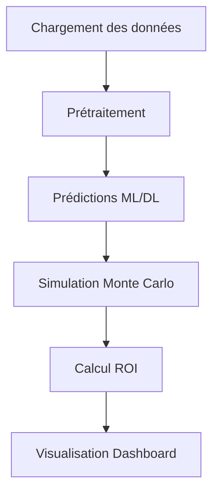

# Documentation de dashboard.py

## Présentation

**Objectif du dashboard**  
Le fichier `dashboard.py` constitue l'interface utilisateur interactive développée avec le framework Streamlit. Son objectif principal est de permettre aux utilisateurs (data scientists, analystes financiers et décideurs) d'explorer les données historiques du tourisme au Maroc, de configurer et d'entraîner divers modèles prédictifs (Machine Learning et Deep Learning) et de générer des projections jusqu'en 2030 sous divers scénarios économiques.

**Rôle dans le projet**  
Il sert de point de rassemblement visuel et interactif pour l'ensemble du pipeline de données. Au lieu de manipuler des scripts Python isolés, l'utilisateur final interagit avec des widgets (sliders, menus déroulants) pour déclencher dynamiquement des tâches d'ingénierie des caractéristiques (Feature Engineering), d'entraînement de modèles et de prévisions financières.

**Position dans l'architecture globale**  
Le dashboard se situe dans la couche "Présentation" (Front-end analytique) de l'architecture. Il importe directement les modules du cœur de l'application (`src.data_loader`, `src.features`, `src.models`, `src.metrics`) et agit comme un orchestrateur qui consomme ces services locaux pour restituer l'information sous forme de graphiques et de métriques de performance.

---

## Architecture

L'architecture du fichier s'articule autour d'un flux de traitement de données linéaire, optimisé par le système de cache de Streamlit :

1. **Chargement des modèles** : Les algorithmes sont encapsulés sous forme de classes (ex: `XgboostModel`, `LstmModel`, `SarimaModel`) importées depuis le répertoire `src.models`. Cela permet une instanciation standardisée possédant les méthodes `.fit()` et `.predict()`.
2. **Chargement des données** : Les sources de données brutes sont consolidées via la fonction `get_clean_tourism_data()`, qui intègre les données historiques, les impacts COVID-19 et gère les valeurs manquantes.
3. **Prétraitement** : Selon les sélections de l'utilisateur dans la barre latérale, la fonction `feat.build_features()` génère les variables explicatives (lags, moyennes mobiles, événements conjoncturels).
4. **Génération des prévisions** : Le processus d'évaluation s'appuie sur une validation croisée dynamique (Walk-Forward) ou statique (Normal). Le module `TimeSeriesSplit` de `scikit-learn` est utilisé pour préserver la chronologie des données.
5. **Simulation Monte Carlo et Calcul du ROI** : Lors de la phase de projection vers 2030, des hypothèses économiques (inflation, choc OPEX, effet Coupe du Monde) sont injectées pour ajuster les prévisions volumétriques et estimer les recettes financières. Ces recettes servent ensuite de socle aux simulations de ROI.
6. **Visualisation** : Les métriques de performance (R², RMSE, MAPE) sont synthétisées via Pandas (`st.dataframe`), tandis que les séries temporelles historiques et prédictives sont affichées via `matplotlib.pyplot` et `st.pyplot`.



---

## Description détaillée des fonctions

### `get_clean_tourism_data()`

* **Paramètres** : Aucun paramètre en entrée.
* **Valeurs retournées** : `pandas.DataFrame` contenant le dataset consolidé et nettoyé (arrivées, recettes, indicateurs macroéconomiques).
* **Description détaillée** : Cette fonction, décorée avec `@st.cache_data` pour éviter de recharger le dataset à chaque interaction de l'utilisateur, orchestre le pipeline de données initial. Elle fusionne les différentes sources, intègre les anomalies historiques (comme la pandémie de COVID-19 via `cleaner.integrate_covid_data`), et procède à la reconstruction algorithmique des séries historiques manquantes pour garantir la continuité du signal temporel.
* **Exemple d'utilisation** : 
  ```python
  df_clean = get_clean_tourism_data()
  ```

---

## Pipeline d'exécution

Lorsqu'un utilisateur initie l'application, le pipeline d'exécution suit séquentiellement ces étapes :

1. **Initialisation de l'interface** : Configuration globale de la page via `st.set_page_config` et injection de styles CSS personnalisés pour garantir une interface ergonomique.
2. **Configuration Globale (Sidebar)** : L'utilisateur définit les paramètres expérimentaux : cible (Arrivées ou Nuitées), année de split de test, méthode de validation, features, et algorithmes à comparer.
3. **Onglet Exploration** : Visualisation instantanée des séries temporelles brutes pour analyser les tendances structurelles et la saisonnalité des données marocaines.
4. **Onglet Entraînement** : Déclenchement conditionnel (`run_btn`). Les données sont segmentées temporellement (Train/Test). Une boucle parcourt les modèles sélectionnés, les entraîne (avec barre de progression pour la méthode Walk-Forward), et génère les prédictions sur le jeu de test. Les résultats sont sauvegardés dans le `session_state` de Streamlit.
5. **Onglet Projections 2030** : Les meilleurs modèles ML et DL identifiés lors de l'entraînement sont exploités de manière récursive pour générer des prévisions futures jusqu'en 2030. L'utilisateur peut y appliquer des chocs économiques dynamiques (Inflation, boost Coupe du Monde 2030) afin de modéliser des scénarios de recettes.

---

## Visualisations

### Analyse Historique des Séries (Onglet Exploration)
* **Source des données** : Dataframe nettoyé `df_clean`.
* **Méthode de calcul** : Représentation graphique directe via `st.line_chart` de la colonne cible en fonction de l'index temporel.
* **Signification métier** : Permet aux experts métiers d'identifier la dynamique globale de la demande touristique et de repérer les chocs structurels (ex: COVID-19 en 2020).
* **Interprétation** : L'observation visuelle confirme les cycles de haute et basse saisons essentiels pour la gestion capacitaire hôtelière.

### Comparaison des Performances Modèles (Onglet Entraînement)
* **Source des données** : Vecteur `y_test` réel et dictionnaire des prédictions générées par chaque modèle évalué.
* **Méthode de calcul** : `matplotlib.pyplot` superposant le signal réel et les différentes signaux prédits. Un tableau `pandas` récapitule les métriques (RMSE, R², etc.) colorisé par performance (`style.highlight_max`).
* **Signification métier** : Aide à la sélection du modèle le plus performant et le plus stable pour réaliser les projections à long terme.
* **Interprétation** : L'utilisateur peut juger du sur-apprentissage (overfitting) ou de la capacité du modèle à capter les retournements de tendance.

### Projection des Arrivées et Recettes Touristiques (Onglet Projections 2030)
* **Source des données** : Séries temporelles générées récursivement (`forecast_recursive_ml` et `dl`) combinées aux inputs de croissance définis par l'utilisateur.
* **Méthode de calcul** : Application de taux de croissance composés (CAGR) relatifs à l'inflation et ajout d'un pourcentage d'impact spécifique pour l'événement "Coupe du Monde 2030".
* **Signification métier** : Modélisation des flux de trésorerie macroéconomiques (Recettes Globales en MDH).
* **Interprétation** : Permet de quantifier les opportunités d'investissement, le besoin en infrastructures supplémentaires et de valider la faisabilité des objectifs stratégiques nationaux.

---

## Captures d'écran

### Dashboard principal


Le tableau de bord principal permet d'accéder aux différentes analyses prédictives. Sur la gauche, la barre latérale offre une granularité fine sur le paramétrage des expériences (algorithmes, dates de split, méthodes d'évaluation). La zone principale présente les données historiques essentielles à la compréhension des flux touristiques.

### Interface de Projection 2030


L'onglet de projection expose les résultats des prédictions jusqu'à l'horizon de la Coupe du Monde 2030. L'utilisateur observe la croissance des flux ainsi que l'impact paramétrable de l'inflation et de l'événement sportif majeur sur les recettes touristiques globales.
