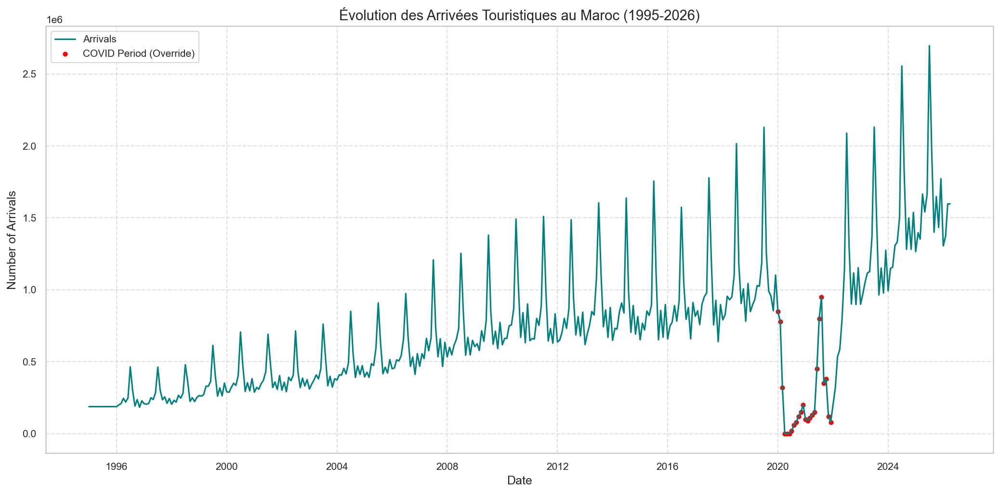
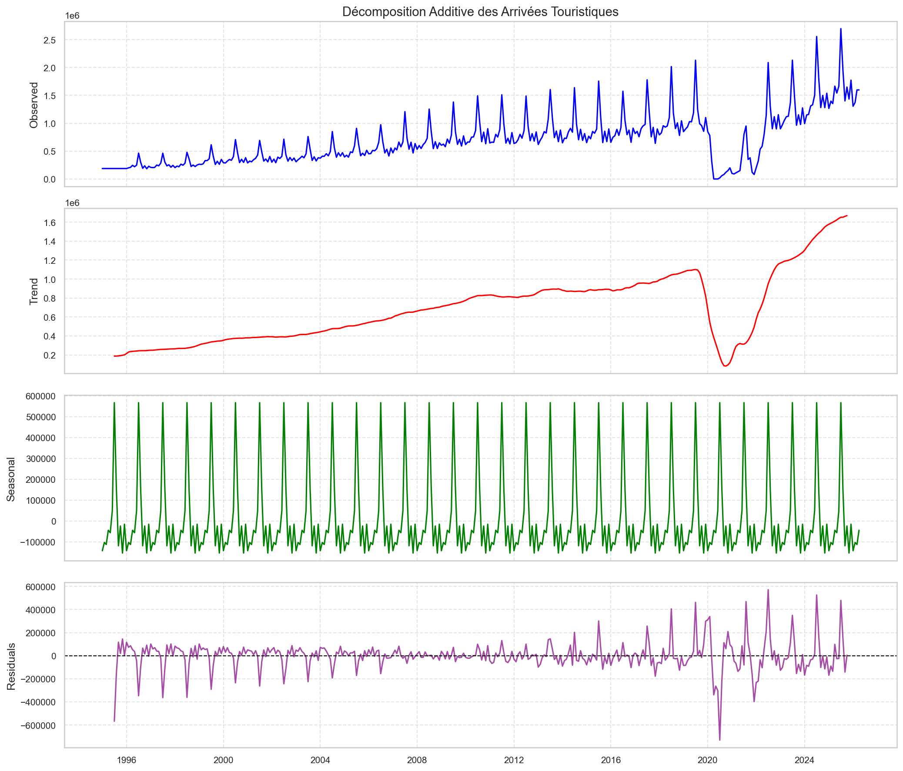
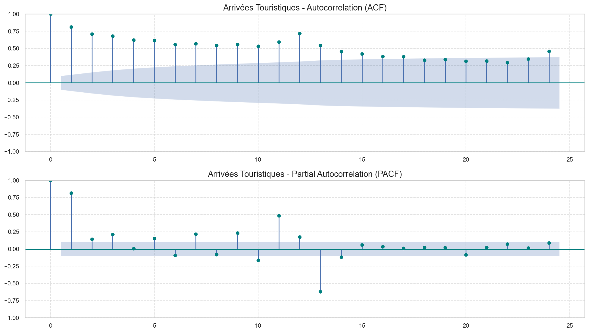
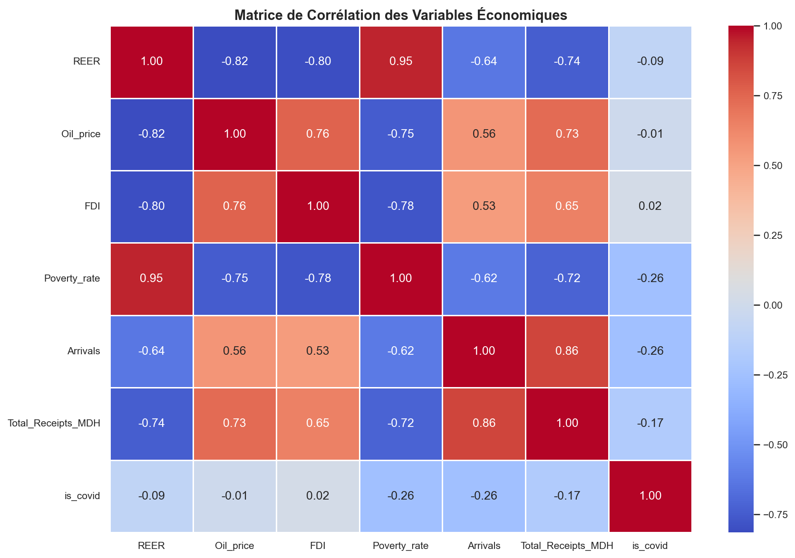
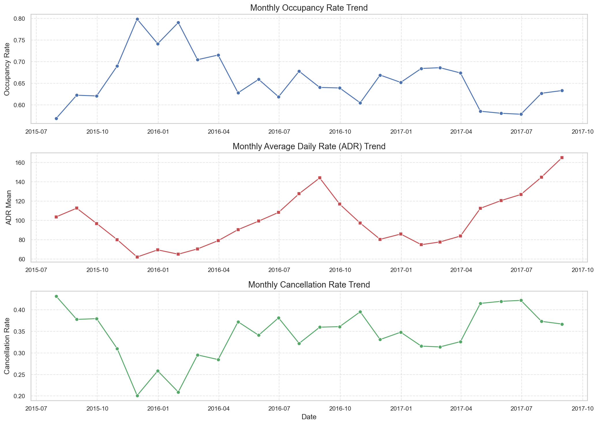
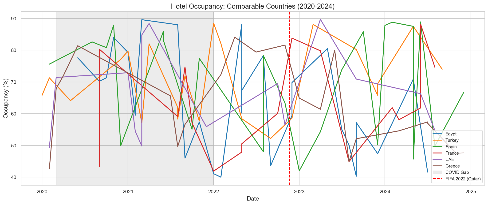
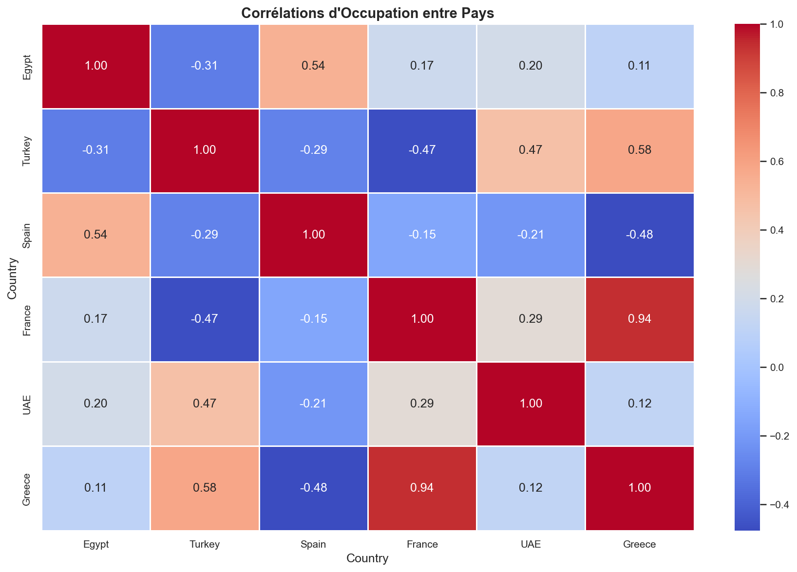

Analyse Exploratoire des Données (EDA)
======================================

Évolution Générale de la Série Cible
---------------------------------------
L'analyse de la série temporelle des arrivées mensuelles au Maroc montre trois phases claires :

1. **Croissance Régulière (2013-2019)** : Un dynamisme structurel avec un Taux de Croissance Annuel Moyen (TCAM) de 5,2%.
2. **Choc COVID-19 (2020-2021)** : Une chute de près de 80% des arrivées au pic de la crise hôtelière.
3. **Rebond Record (2022-2025)** : Une reprise rapide dépassant les records d'avant-crise pour atteindre un sommet de 19,8 millions de touristes en 2025.

Décomposition Season-Trend (STL)
--------------------------------
Une décomposition additive de la série temporelle (tendance + saisonnalité + résidus) permet d'en extraire la dynamique :

* **Tendance** : Confirme une croissance de fond très forte après 2022, ce qui justifie l'optimisme des prévisions pour 2030.
* **Saisonnalité** : Identifie un profil annuel extrêmement stable. Les pics d'activité majeurs se concentrent sur juillet et août (haute saison estivale), tandis que les creux récurrents se situent en janvier et décembre.
* **Résiduels** : Isolent les chocs exogènes imprévisibles (le gouffre de la crise COVID-19, le rebond rapide post-crise de 2022, et l'impact positif attendu de la Coupe d'Afrique des Nations 2025).

Tests de Stationnarité
----------------------
La stationnarité a été validée scientifiquement à l'aide de trois tests complémentaires sur la série brute des arrivées :

* **Test Dickey-Fuller Augmenté (ADF)** : Statistique = -1,76 | p-value = 0,4003 (H0 de non-stationnarité non rejetée). La série brute est **non stationnaire**.
* **Test KPSS** : Statistique = 1,83 | p-value = 0,01 (H0 de stationnarité rejetée). Confirme la **non-stationnarité**.
* **Test Phillips-Perron (PP)** : Statistique = -6,46 | p-value < 0,0001 (rejet de la racine unitaire).

*Conclusion* : Compte tenu de la non-stationnarité détectée par les tests ADF et KPSS, une double différenciation (différenciation simple et différenciation saisonnière de lag 12) a été appliquée pour le modèle statistique SARIMAX afin de stabiliser la moyenne et la variance.

Analyse d'Autocorrélation (ACF/PACF)
------------------------------------
Pour caractériser la dépendance temporelle de la série et calibrer les ordres du modèle statistique SARIMAX, les fonctions d'autocorrélation (ACF) et d'autocorrélation partielle (PACF) ont été estimées :

* **Série Brute** : L'ACF montre une décroissance lente et sinusoïdale avec des pics significatifs tous les 12 mois, confirmant une forte non-stationnarité en moyenne et une saisonnalité annuelle marquée.
* **Série Différenciée (d=1, D=1, s=12)** : Après différenciations, la série est stationnarisée. L'analyse des corrélations résiduelles montre des pics significatifs à certains lags, permettant d'identifier une structure auto-régressive d'ordre 2 pour la partie non saisonnière, et un ordre MA saisonnier.

Corrélations des Variables Macroéconomiques
-------------------------------------------
L'analyse de la matrice de corrélation de Pearson révèle l'impact des variables macroéconomiques sur le volume des arrivées :

* **Recettes Touristiques (`Total_Receipts_MDH`)** : Corrélation très élevée de **0,81** avec les arrivées, confirmant le lien direct entre volume de visiteurs et rentabilité financière du secteur.
* **Taux de Change Effectif Réel (`REER`)** : Corrélation négative marquée de **-0,63**. Une appréciation du Dirham dégrade la compétitivité-prix de la destination Maroc pour les touristes étrangers.
* **Taux de Pauvreté (`Poverty_rate`)** : Corrélation négative de **-0,61** reflétant la structure de développement sous-jacente.
* **Prix du Pétrole (`Oil_price`)** : Corrélation positive modérée de **0,54**, principalement liée à la coïncidence temporelle des phases de croissance globale.
* **Investissements Directs Étrangers (`FDI`)** : Corrélation positive de **0,50**, traduisant le rôle du capital étranger dans l'essor des infrastructures d'accueil.

Analyses Hôtelières et Benchmark Internationaux
-----------------------------------------------
* **Tendances Hôtelières** : L'analyse des données de réservations montre des cycles hôteliers marqués avec une forte saisonnalité des taux d'occupation mensuels, des tarifs journaliers moyens (ADR) et du taux d'annulation.

* **Benchmark d'Occupation** : La comparaison avec les destinations concurrentes (Espagne, Turquie, Égypte, France, EAU) montre que le Maroc a enregistré l'un des plus forts taux de récupération de l'occupation hôtelière post-COVID, devant l'Égypte et à des niveaux proches de l'Espagne.

* **Corrélations d'Occupation entre Destinations** : Les dynamiques d'occupation touristique s'avèrent fortement corrélées positivement entre destinations européennes / méditerranéennes (Espagne-France-Grèce), tandis que le Moyen-Orient (EAU) présente un profil déphasé.

