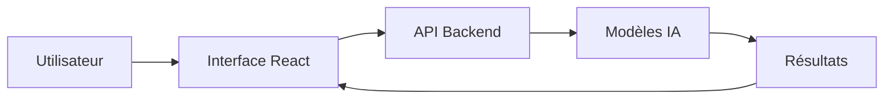

# Documentation de frontend/src/App.jsx

## Présentation

**Rôle du Frontend React**  
Le fichier `App.jsx` agit comme le point d'entrée principal de l'interface utilisateur web développée en React. Son rôle est d'orchestrer la navigation et le rendu des différents modules analytiques de l'application. Contrairement au dashboard Streamlit orienté prototypage rapide, ce frontend React est conçu pour offrir une expérience utilisateur (UX) de qualité production, réactive et hautement personnalisable.

**Objectif de l'interface utilisateur**  
L'objectif est d'encapsuler la complexité des modèles d'Intelligence Artificielle et des simulations financières dans des interfaces graphiques épurées et intuitives. Les décideurs peuvent ainsi naviguer fluidement entre l'analyse historique, l'évaluation des modèles, la prévision ("Forecasting") et les simulations financières complexes (ROI & Monte Carlo) sans avoir à se soucier de l'implémentation sous-jacente.

**Relation avec le Backend**  
Cette architecture découplée implique que le Frontend React est responsable exclusivement de la couche présentation et de la gestion de l'état local. Il interagit avec un Backend distant (via des API RESTful ou GraphQL) pour récupérer les données historiques, soumettre des requêtes d'inférence aux modèles IA, et recevoir les résultats des simulations de ROI.

---

## Architecture React

L'architecture s'appuie sur les principes des Single Page Applications (SPA) modernes :

* **Structure des composants** : Le fichier adopte une structure classique de "Layout". Il inclut un conteneur racine `div`, une barre latérale de navigation (`aside`), un header d'en-tête dynamique (`header`) et une zone principale dynamique (`main`) où les vues ("pages") sont injectées.
* **State Management** : L'état applicatif est géré de façon légère et locale via le hook `useState`. L'état `currentPage` dicte le composant page à rendre, tandis que l'état `sidebarOpen` contrôle la responsivité et l'affichage mobile.
* **Communication API** : La communication asynchrone est déléguée aux sous-composants métiers (`Dashboard`, `Forecasting`, `RoiSimulator`). `App.jsx` agit comme un conteneur "stupide" (dumb layout component) garantissant une séparation claire des responsabilités.
* **Navigation** : Le routage est implémenté manuellement via un `switch` dans la fonction `renderPage()`. Cela permet des transitions fluides gérées par `framer-motion` sans la surcharge d'une bibliothèque de routage externe pour une structure d'application simple.
* **Gestion des événements** : L'interactivité globale (ouverture/fermeture du menu, sélection d'un onglet, clic sur le bouton d'export) est gérée par des gestionnaires d'événements React standards (`onClick`).

---

## Analyse détaillée du composant App.jsx

### Imports
L'application repose sur des bibliothèques reconnues pour l'UI :
* `lucide-react` : Fournit un jeu d'icônes vectorielles (SVG) légères et cohérentes (ex: `LayoutDashboard`, `TrendingUp`).
* `framer-motion` : Assure les animations déclaratives fluides (`AnimatePresence`, `motion.div`), notamment pour les transitions de page et le comportement du menu sur mobile.
* Imports locaux : Intégration des composants pages (`Dashboard`, `Forecasting`, `RoiSimulator`, `MonteCarlo`).

### Hooks React & États
* `const [currentPage, setCurrentPage] = useState('models')` : Détermine l'onglet actif.
* `const [sidebarOpen, setSidebarOpen] = useState(true)` : Gère l'état d'affichage de la barre latérale, crucial pour l'adaptabilité mobile (Responsive Design).

### Fonctions
* `renderPage()` : Moteur de rendu conditionnel. Selon la valeur de `currentPage`, elle instancie et retourne le composant métier approprié, en lui passant optionnellement des "props" (ex: `activeSection={currentPage}` pour le composant `Forecasting`).

### Gestion de l'Interface
* **Classes CSS Tailwind** : L'application utilise intensivement Tailwind CSS pour un design utilitaire et moderne (effets *glassmorphism* avec `backdrop-blur`, dégradés complexes `bg-gradient-to-br`, adaptabilité via les préfixes `md:`).
* **Adaptabilité Mobile** : Intégration d'un overlay (`bg-black/60`) qui assombrit le fond lorsqu'on ouvre le menu latéral sur de petits écrans.

---

## Interface utilisateur

### Navigation Latérale (Sidebar)
* **Objectif** : Permettre à l'utilisateur de basculer instantanément entre les différents modules d'analyse.
* **Composants utilisés** : Boutons générés dynamiquement via la méthode `.map()` sur un tableau d'objets `navItems`. Utilisation de `motion.div` pour animer l'indicateur actif.
* **Données affichées** : Noms des vues et indicateur global du statut du système ("All models online").
* **Interactions possibles** : Clic pour changer de page, masquage automatique sur les terminaux mobiles post-clic.

### Header Supérieur
* **Objectif** : Indiquer le contexte de l'application et offrir des actions globales.
* **Composants utilisés** : Texte dynamique, boutons de filtres et d'action.
* **Données affichées** : Titre de la page en cours, nom du dataset actif ("Tourism_Morocco_2026.csv").
* **Interactions possibles** : Bouton d'exportation de rapport, bascule du menu burger (`Menu` icon) sur les petits écrans.

### Zone de Contenu Principal (Main Content)
* **Objectif** : Conteneur encapsulant les données et graphiques interactifs des modèles d'IA et de ROI.
* **Composants utilisés** : `AnimatePresence` et `motion.div` encapsulant le résultat de la fonction `renderPage()`.
* **Interactions possibles** : Scroll et interaction directe avec les composants enfants spécifiques au domaine métier.

---

## Workflow utilisateur

1. **Ouverture de l'application** : Le composant se monte, l'état `currentPage` s'initialise (sur "Forecasting Models" ou "Overview"). L'utilisateur visualise la mise en page globale.
2. **Saisie des paramètres** : L'utilisateur navigue vers la section souhaitée (ex: "ROI Calculator").
3. **Envoi vers le Backend** : Au sein des composants enfants (comme `RoiSimulator`), des formulaires permettent d'affiner les hypothèses économiques qui sont ensuite transmises via des appels `fetch` ou `axios` au serveur API.
4. **Génération des prévisions** : Le backend effectue l'inférence des modèles de Machine/Deep Learning ou les calculs de Monte Carlo.
5. **Affichage des résultats** : L'état local du composant enfant est mis à jour, déclenchant un nouveau rendu affichant les graphiques (via Recharts, Chart.js ou équivalent).
6. **Analyse du ROI** : L'utilisateur interagit avec les résultats visuels pour valider les décisions stratégiques et peut finaliser son analyse en cliquant sur "Export Report" dans le Header.

---

## Captures d'écran

### Interface de simulation

Cette interface permet à l'utilisateur d'explorer visuellement l'application React. On y observe la disposition ergonomique : la navigation intuitive sur la gauche facilitant l'accès aux différents modules de Data Science, le panneau d'état système, et le header proposant l'exportation globale des rapports d'analyses.
