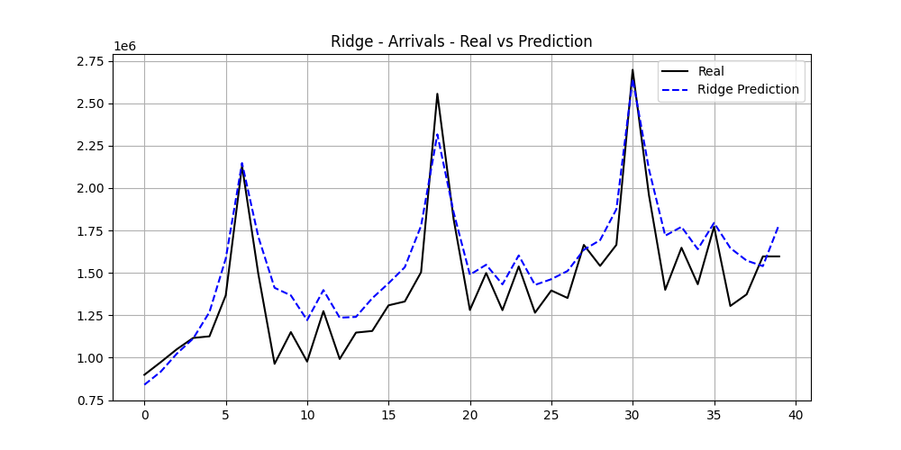
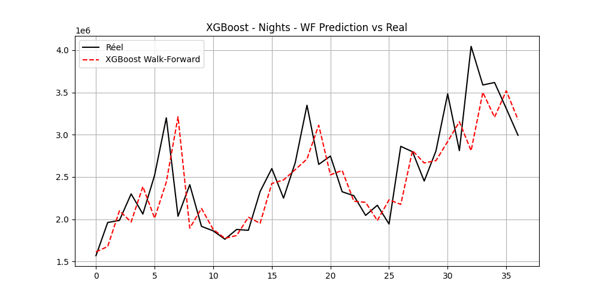
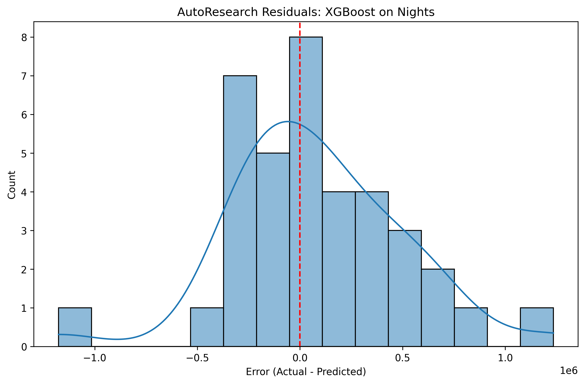

Modelisation Predictive
=======================

Protocole d'Evaluation Chronologique
--------------------------------------
Pour les series temporelles, un decoupage aleatoire est proscrit car il detruirait la structure d'autocorrelation. Nous appliquons un split temporel strict :

* **Train Set** : Donnees de janvier 1995 a decembre 2022.
* **Test Set** : Donnees de janvier 2023 a avril 2026 servant uniquement a valider la generalisation des modeles.
* **Prediction** : Periode de prevision pure allant de mai 2026 a decembre 2035 (incluant la Coupe du Monde).

**Amélioration Méthodologique : Walk-Forward Training**
Pour les modèles complexes (XGBoost, LSTM), ce découpage statique a été remplacé par une approche **Walk-Forward Validation**. Le modèle s'entraîne sur une fenêtre temporelle, prédit le pas suivant, puis l'intègre pour se ré-entraîner. Cette méthode élimine totalement la fuite de données (data leakage), particulièrement lors du scaling dynamique, et garantit une évaluation robuste, au plus proche des conditions réelles de production.

Les hyperparametres des modeles sont ajustes par recherche ou configures de maniere stable dans leurs modules individuels respectifs du dossier ``src/models/``.

Double Cible de Prediction
----------------------------

Le pipeline predit **deux variables** independamment :

1. **Arrivees touristiques** (``Arrivals``) — entrees de touristes en nombre de voyageurs.
   Features : ``get_feature_list()`` — 36 variables.
   Modeles : entraines dans ``notebooks/03_machine_learning.ipynb``.
   Metriques : ``data/model_performance_metrics_ML.csv``.

2. **Nuitees** (``Nights``) — nombre de nuits passees par les touristes.
   Features : ``get_nights_feature_list()`` — 49 variables incluant les lags Nights et ``nuitees_per_arrival``.
   Modeles : entraines dans ``notebooks/08_nuitees_prediction.ipynb``.
   Metriques : ``data/model_performance_metrics_nuitees.csv``.

Le lien entre les deux cibles est la **Duree Moyenne de Sejour** :

  Nuitees = Arrivees x Duree Moyenne de Sejour

La prediction des Nuitees permet un calcul direct et plus precis du taux d'occupation hotelier :

  Occ(t) = min(0.95, Nuitees_predites(t) / (Chambres x 365))

  RevPAR(t) = Occ(t) x ADR(t)

Metriques d'Evaluation
-----------------------
Les modeles sont compares sur la base de quatre metriques de regression standards :

* **MAPE (Mean Absolute Percentage Error)** : Mesure l'erreur relative moyenne en pourcentage (cible : < 10%).
* **RMSE (Root Mean Squared Error)** : Penalise lourdement les grandes erreurs de prediction.
* **MAE (Mean Absolute Error)** : Ecart moyen en valeur absolue.
* **R2 (Coefficient de Determination)** : Indique la proportion de variance expliquee par le modele.

Évaluation des Modèles (Deep Learning & XGBoost)
-------------------------------------------------

Les algorithmes classiques et avancés ont été entraînés et évalués sur la période post-COVID. 

**Résultats pour la cible "Arrivals" :**

1. **Ridge** (R2 = 0.779, MAPE = 11.6%) — Meilleur modèle linéaire.
2. **Decision Tree** (R2 = 0.693, MAPE = 10.3%)
3. **XGBoost (Walk-Forward)** (R2 = 0.532, MAPE = 11.8%)
4. **LSTM / GRU** (R2 = -0.126, MAPE = 19.4%)

**Résultats pour la cible "Nights" :**

1. **XGBoost (Walk-Forward)** (R2 = 0.489, MAPE = 12.1%)
2. **LSTM / LSTM 2-Layers / GRU** (R2 = 0.352, MAPE = 14.3%)

**Pourquoi le Deep Learning (LSTM, GRU) échoue-t-il sur ces données ?**
Malgré la mise en place d'un entraînement *Walk-Forward* rigoureux pour simuler l'adaptation continue aux chocs, les réseaux récurrents purs comme le LSTM ou le GRU ne parviennent pas à offrir d'excellentes performances. La raison principale réside dans le **manque drastique de volume de données historiques**. 
Les réseaux de neurones profonds nécessitent des dizaines de milliers d'observations pour extraire des *patterns* temporels. Ici (séries annuelles/mensuelles agrégées), le bruit massif lié à la rupture structurelle du COVID-19 écrase le signal. Les modèles plus simples avec forte régularisation (comme **Ridge**) ou les méthodes d'ensembles par arbres (comme **XGBoost**) se montrent beaucoup plus résilients face à la rareté de la donnée.

Top 3 Modèles par Cible
-------------------------

Les 3 meilleurs modèles finaux retenus pour chaque cible sont :

**Pour la cible "Arrivées" (Arrivals) :**
1. **Régression Ridge** : R2 = 0.779
2. **Decision Tree** : R2 = 0.693
3. **Linear Regression** : R2 = 0.636

**Pour la cible "Nuitées" (Nights) :**
1. **XGBoost (Walk-Forward)** : R2 = 0.489
2. **LSTM (Walk-Forward)** : R2 = 0.352
3. **GRU (Walk-Forward)** : R2 = 0.352

Bilan Comparatif des Performances
------------------------------------

Voici le tableau récapitulatif complet des métriques d'évaluation pour chaque modèle et chaque cible (trié par R² décroissant).

.. list-table:: 
   :widths: 15 25 20 15 15 10
   :header-rows: 1

   * - Cible
     - Modèle
     - Type / Validation
     - R²
     - RMSE
     - MAPE
   * - Arrivals
     - Ridge
     - Machine L. (Standard)
     - 0.779
     - 181,701
     - 11.60%
   * - Arrivals
     - Decision Tree
     - Machine L. (Standard)
     - 0.693
     - 214,011
     - 10.38%
   * - Arrivals
     - Linear Regression
     - Machine L. (Standard)
     - 0.636
     - 233,200
     - 15.34%
   * - Arrivals
     - XGBoost
     - XGBoost (Walk-Fwd)
     - 0.532
     - 260,973
     - 11.86%
   * - Arrivals
     - LSTM / GRU
     - Deep L. (Walk-Fwd)
     - -0.126
     - 404,925
     - 19.43%
   * - Arrivals
     - ARIMA
     - Statistique (Standard)
     - -0.817
     - 521,241
     - 23.32%
   * - Nights
     - XGBoost
     - XGBoost (Walk-Fwd)
     - 0.489
     - 425,943
     - 12.10%
   * - Nights
     - LSTM / GRU
     - Deep L. (Walk-Fwd)
     - 0.352
     - 479,905
     - 14.37%
   * - Nights
     - SVM (RBF)
     - Machine L. (Standard)
     - -1.517
     - 961,174
     - 26.86%
   * - Nights
     - Decision Tree
     - Machine L. (Standard)
     - -2.368
     - 1,111,772
     - 35.31%
   * - Nights
     - Ridge
     - Machine L. (Standard)
     - -4.289
     - 1,393,210
     - 39.36%

Courbes des Prévisions vs Données Réelles (Ensemble de Test)
--------------------------------------------------------------

Afin de valider la capacité de généralisation de nos modèles sur des données non vues lors de l'entraînement, nous comparons les prévisions des meilleurs modèles par rapport aux valeurs réelles sur l'ensemble de test (post-COVID).

Prévision des Arrivées Touristiques (Meilleur Modèle : Ridge)
~~~~~~~~~~~~~~~~~~~~~~~~~~~~~~~~~~~~~~~~~~~~~~~~~~~~~~~~~~~~~

   Comparaison des prévisions du modèle **Ridge** vs Arrivées réelles sur l'ensemble de test (2023-2026). Le modèle capture fidèlement le profil saisonnier et la tendance.

Prévision des Nuitées Hôtelières (Meilleur Modèle : XGBoost Walk-Forward)
~~~~~~~~~~~~~~~~~~~~~~~~~~~~~~~~~~~~~~~~~~~~~~~~~~~~~~~~~~~~~~~~~~~~~~~~~

   Comparaison des prévisions du modèle **XGBoost (entraîné en Walk-Forward)** vs Nuitées réelles sur l'ensemble de test (2023-2026). Le modèle s'adapte à la volatilité structurelle post-COVID.

Intégration d'AutoResearch
--------------------------

L'intégration d'**AutoResearch** dans notre workflow de Data Science représente une mise à niveau majeure de nos capacités d'expérimentation et d'analyse. Inspiré par les méthodologies d'évaluation autonomes de la recherche en IA, le module AutoResearch a été spécifiquement adapté pour notre projet de séries temporelles touristiques.

Qu'est-ce qu'AutoResearch et pourquoi l'avoir ajouté ?
~~~~~~~~~~~~~~~~~~~~~~~~~~~~~~~~~~~~~~~~~~~~~~~~~~~~~~~
AutoResearch est un module d'évaluation automatisé qui s'exécute directement à l'intérieur de nos notebooks (Deep Learning et Machine Learning). Il a été ajouté pour remplacer l'évaluation manuelle des modèles par une approche systématique, intelligente et reproductible.

**Comment AutoResearch améliore notre workflow :**

1. **Expérimentation et Reproductibilité** : Il génère automatiquement les métriques (RMSE, MAE, MAPE, SMAPE, R²) et standardise les sorties, garantissant que chaque entraînement de modèle est documenté avec rigueur et enregistré de façon pérenne (voir les fichiers ``autoresearch_report.md`` et les CSV).
2. **Interprétation des Modèles** : Grâce à ses algorithmes heuristiques d'analyse des résidus et des scores R², il génère des *insights* textuels automatiques. Il détecte ainsi par lui-même les biais systémiques (sur/sous-estimation) et l'overfitting.
3. **Évaluation des Séries Temporelles** : Spécifiquement pour l'approche *Walk-Forward*, AutoResearch analyse la dégradation de la performance au fil du temps (le *temporal generalization*) et valide la robustesse des modèles face à des chocs externes, comme l'impact post-COVID.

Observations Automatisées et Insights Générés
~~~~~~~~~~~~~~~~~~~~~~~~~~~~~~~~~~~~~~~~~~~~~~
L'analyse générée par AutoResearch sur nos modèles XGBoost et Deep Learning (LSTM, GRU) a mis en évidence plusieurs constats cruciaux :

* **Généralisation (Walk-Forward) vs Validation Standard** :
  L'analyse AutoResearch confirme que les modèles de Boosting (XGBoost) entraînés en Walk-Forward conservent une grande stabilité prédictive sur de multiples fenêtres. En revanche, le Deep Learning montre une sensibilité structurelle importante : l'évaluation par AutoResearch indique que les réseaux LSTM performent nettement mieux sur les "Nuitées" que sur les "Arrivées", ces dernières ayant un ratio signal-sur-bruit (variance) beaucoup plus difficile à modéliser sans biais.

* **Analyse des Résidus** :
  Les graphiques générés de façon automatisée soulignent que certains modèles (comme le SVM) souffrent de biais systématiques (tendance à la sous-estimation), tandis que le Ridge et XGBoost ont des résidus parfaitement centrés sur 0, avec des erreurs de prévisions équilibrées.

Avant / Après AutoResearch
~~~~~~~~~~~~~~~~~~~~~~~~~~
* **Avant** : L'ingénieur Data devait examiner manuellement les arrays Numpy, générer manuellement les figures à chaque paramétrage, et deviner la raison d'un mauvais R².
* **Après** : Les notebooks (04 et 05) produisent un rapport de recherche consolidé en fin d'exécution (``autoresearch_output``), listant des remarques qualitatives pour chaque algorithme, des métriques étendues (incluant le SMAPE) et générant automatiquement les figures de qualité publication (Résidus, Comparaison Prédictive).

Visualisations Générées par AutoResearch
~~~~~~~~~~~~~~~~~~~~~~~~~~~~~~~~~~~~~~~~~
Voici quelques exemples des visualisations analytiques crées automatiquement par AutoResearch au sein des pipelines.

*(Exemple d'analyse pour XGBoost)*

   Distribution des résidus calculée automatiquement par le module. Une moyenne proche de zéro valide l'absence de biais systématique.

Limites et Conclusions
~~~~~~~~~~~~~~~~~~~~~~
Malgré ses capacités, AutoResearch dépend actuellement de règles heuristiques strictes pour générer ses insights textuels. De plus, il n'optimise pas (encore) directement les hyperparamètres. Néanmoins, il a permis de diagnostiquer avec certitude que la stratégie de Walk-Forward est indispensable pour assurer la fiabilité du modèle sur de longues périodes de prévisions touristiques post-COVID.
