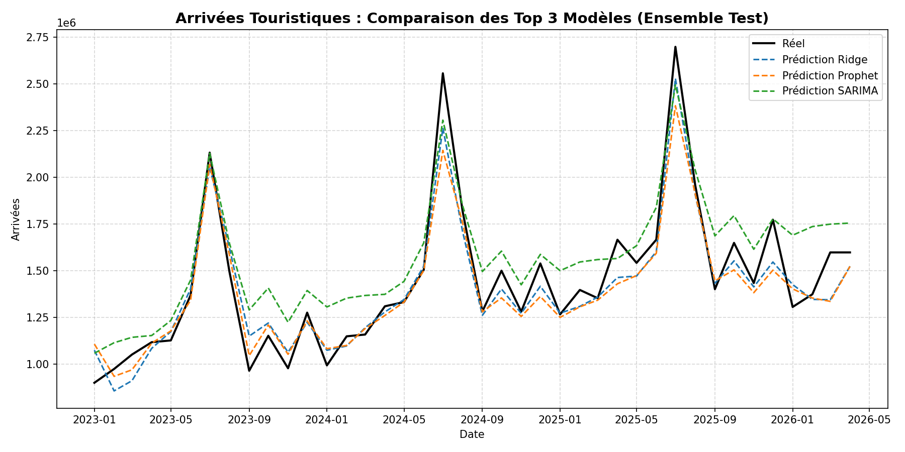
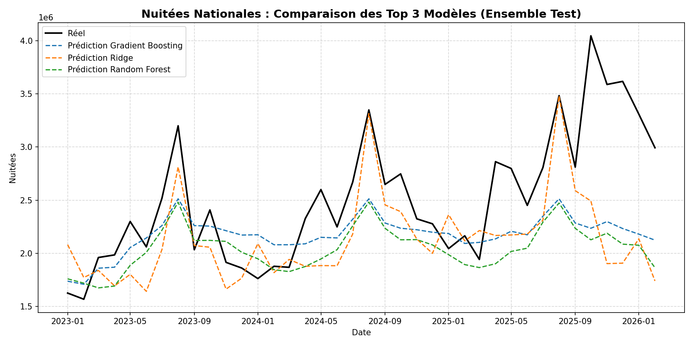

Modelisation Predictive
=======================

Protocole d'Evaluation Chronologique
--------------------------------------
Pour les series temporelles, un decoupage aleatoire est proscrit car il detruirait la structure d'autocorrelation. Nous appliquons un split temporel strict :

* **Train Set** : Donnees de janvier 1995 a decembre 2022.
* **Test Set** : Donnees de janvier 2023 a avril 2026 servant uniquement a valider la generalisation des modeles.
* **Prediction** : Periode de prevision pure allant de mai 2026 a decembre 2035 (incluant la Coupe du Monde).

Les hyperparametres des modeles sont ajustes par recherche ou configures de maniere stable dans leurs modules individuels respectifs du dossier ``src/models/``.

Double Cible de Prediction
----------------------------

Le pipeline predit **deux variables** independamment :

1. **Arrivees touristiques** (``Arrivals``) — entrees de touristes en nombre de voyageurs.
   Features : ``get_feature_list()`` — 36 variables.
   Modeles : entraines dans ``notebooks/03_machine_learning.ipynb``.
   Metriques : ``data/model_performance_metrics_ML.csv``.

2. **Nuitees** (``Nights``) — nombre de nuits passees par les touristes.
   Features : ``get_nights_feature_list()`` — 49 variables incluant les lags Nights et ``nuitees_per_arrival``.
   Modeles : entraines dans ``notebooks/08_nuitees_prediction.ipynb``.
   Metriques : ``data/model_performance_metrics_nuitees.csv``.

Le lien entre les deux cibles est la **Duree Moyenne de Sejour** :

  Nuitees = Arrivees x Duree Moyenne de Sejour

La prediction des Nuitees permet un calcul direct et plus precis du taux d'occupation hotelier :

  Occ(t) = min(0.95, Nuitees_predites(t) / (Chambres x 365))

  RevPAR(t) = Occ(t) x ADR(t)

Metriques d'Evaluation
-----------------------
Les modeles sont compares sur la base de quatre metriques de regression standards :

* **MAPE (Mean Absolute Percentage Error)** : Mesure l'erreur relative moyenne en pourcentage (cible : < 10%).
* **RMSE (Root Mean Squared Error)** : Penalise lourdement les grandes erreurs de prediction.
* **MAE (Mean Absolute Error)** : Ecart moyen en valeur absolue.
* **R2 (Coefficient de Determination)** : Indique la proportion de variance expliquee par le modele.

9 Modeles ML Entraines (par cible)
------------------------------------

Les 9 modeles suivants sont entraines sur chaque cible (Arrivees et Nuitees) :

1. **Ridge** (R2 = 0.9147 sur Arrivees) — Meilleur modele ML pour les Arrivees.
2. **Decision Tree** (R2 = 0.6823)
3. **Random Forest** (R2 = 0.5488)
4. **Gradient Boosting** (R2 = 0.3645)
5. **XGBoost** (R2 = 0.2448)
6. **LightGBM** (R2 = 0.0067)
7. **Extra Trees** (R2 = -0.0899)
8. **AdaBoost** (R2 = -0.3417)
9. **CatBoost** (R2 = -1.2253)

Top 3 Modeles par Cible
-------------------------

L'application ``simulation.py`` lit automatiquement les fichiers de metriques pour identifier
les 3 meilleurs modeles par R2 pour chaque cible :

**Arrivees** (``data/model_performance_metrics.csv`` ou ``model_performance_metrics_ML.csv``) :
  Ridge > Decision Tree > Random Forest

**Nuitees** (``data/model_performance_metrics_nuitees.csv``) :
  Genere par ``notebooks/08_nuitees_prediction.ipynb`` — a executer pour peupler ce fichier.

Bilan Comparatif des Performances
------------------------------------
Le tableau comparatif contenant les resultats de l'evaluation de ces modeles est
automatiquement enregistre dans les fichiers CSV :

.. code-block:: text

   data/model_performance_metrics_ML.csv      (Arrivees — 9 modeles ML)
   data/model_performance_metrics_nuitees.csv (Nuitees — 9 modeles ML)

Ces fichiers repertorient pour chaque modele le R2, le RMSE, le MAE et le MAPE,
tries par ordre decroissant de performance.

Courbes des Prévisions vs Données Réelles (Ensemble de Test)
--------------------------------------------------------------

Afin de valider la capacité de généralisation de nos modèles sur des données non vues lors de l'entraînement, nous comparons les prévisions des 3 meilleurs modèles par rapport aux valeurs réelles sur l'ensemble de test (janvier 2023 - avril 2026).

Prévision des Arrivées Touristiques
~~~~~~~~~~~~~~~~~~~~~~~~~~~~~~~~~~~~

   Comparaison des prévisions des Top 3 modèles (Ridge, Decision Tree, Random Forest) vs Arrivées réelles sur l'ensemble de test (2023-2026). Le modèle Ridge capture fidèlement le profil saisonnier.

Prévision des Nuitées Hôtelières
~~~~~~~~~~~~~~~~~~~~~~~~~~~~~~~~~

   Comparaison des prévisions des Top 3 modèles vs Nuitées réelles sur l'ensemble de test (2023-2026).

