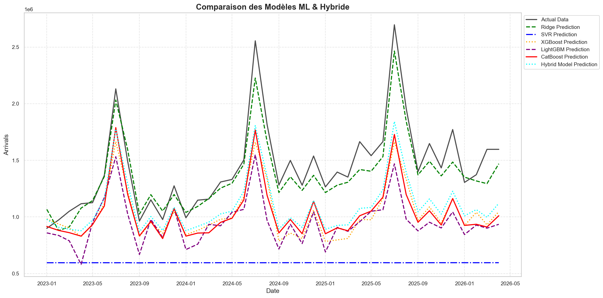
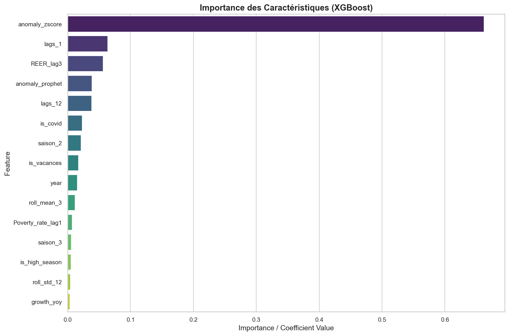
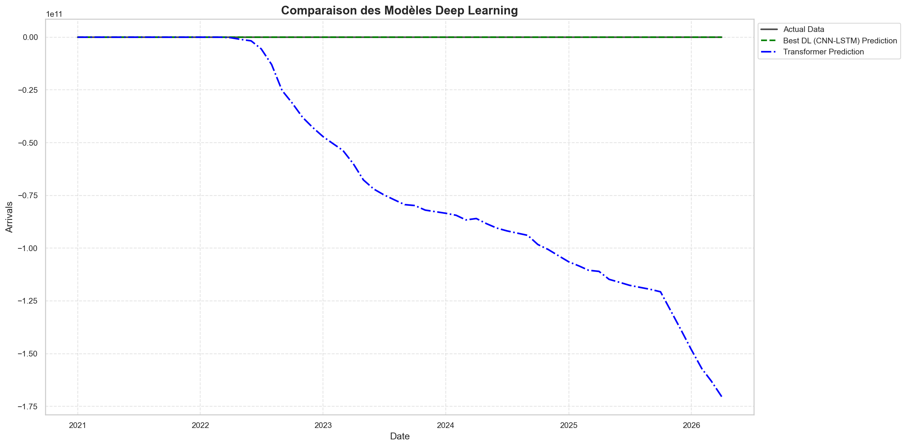

Modélisation Prédictive
=======================

Protocole d'Évaluation Chronologique
------------------------------------
Pour les séries temporelles, un découpage aléatoire est proscrit car il détruirait la structure d'autocorrélation. Nous appliquons un split temporel strict :

* **Train Set** : Données de janvier 1995 à décembre 2022 (soit 80% des observations mensuelles).
* **Test Set** : Données de janvier 2023 à avril 2026 (soit 20% des observations mensuelles) servant uniquement à valider la généralisation des modèles.
* **Prédiction** : Période de prévision pure allant de mai 2026 à décembre 2030 (incluant la Coupe du Monde).

Les hyperparamètres des modèles de Machine Learning sont ajustés par recherche sur grille (`GridSearchCV`) couplée à une validation croisée sur séries temporelles (`TimeSeriesSplit`).

Métriques d'Évaluation
----------------------
Les modèles sont comparés sur la base de quatre métriques de régression standards :

* **MAPE (Mean Absolute Percentage Error)** : Notre métrique principale, mesurant l'erreur relative moyenne en pourcentage (cible : < 10%).
* **RMSE (Root Mean Squared Error)** : Pénalise lourdement les grandes erreurs de prédiction.
* **MAE (Mean Absolute Error)** : Écart moyen en valeur absolue.
* **$R^2$ (Coefficient de Détermination)** : Indique la proportion de variance expliquée par le modèle.

Modèle Statistique de Référence (SARIMAX)
--------------------------------------------
Un modèle SARIMAX a été entraîné en tant que baseline statistique. La structure optimale sélectionnée par optimisation automatique du critère AIC/BIC est :

.. math::

   \text{SARIMAX}(2, 1, 0)(1, 0, 1)_{12}

* **AIC** : 8647.38
* **Test Ljung-Box (p-value)** : 0,97 (pas d'autocorrélation résiduelle significative, démontrant que le modèle capte correctement la dépendance temporelle).
* **Jarque-Bera & Hétéroscédasticité** : Révèlent une non-normalité des résidus et une variance instable, justifiée par les chocs structurels (COVID-19).
* **MAPE de Test** : 8,88% ($R^2$ = 0,7095) avec une prise en compte partielle du choc COVID.

Modèles de Machine Learning Classiques
--------------------------------------
Cinq algorithmes de ML ont été évalués avec recherche d'hyperparamètres sur l'ensemble de caractéristiques construites :

1. **Régression Ridge** : Régression linéaire régularisée L2. Offre une performance robuste avec un **MAPE de 8,17%** et un **$R^2$ de 0,7826** sur le test, montrant que les relations linéaires et les lags construits suffisent pour guider une prévision fiable.
2. **Support Vector Regression (SVR)** : Donne des résultats insatisfaisants en raison d'une mauvaise calibration sur l'échelle et de la présence de valeurs extrêmes de pandémie (MAPE de 56,66%).
3. **XGBoost, LightGBM et CatBoost** : Algorithmes d'arbres de décision boostés. XGBoost et CatBoost capturent les relations non linéaires avec succès.
4. **Forecast Hybride** : Un modèle d'ensemble pondéré combinant 50% XGBoost, 30% CatBoost et 20% Ridge pour maximiser la robustesse en combinant prévisions d'arbres et prévisions linéaires régularisées.

Importance des Caractéristiques (Feature Importance)
----------------------------------------------------
Pour évaluer la contribution des différentes variables prédictives, nous analysons l'importance globale des caractéristiques extraites du modèle XGBoost :

* **Importance Globale** : Identifie que le lag de 12 mois (`Arrivals_lag12`), le volume de nuitées (`Nights`), les recettes touristiques et les indicateurs économiques (`REER`, `Oil_price`) sont les variables les plus décisives pour guider les prévisions du modèle.

Modélisation par Deep Learning (DL)
-----------------------------------
Pour capter la mémoire séquentielle profonde, nous avons déployé des réseaux récurrents et Attention :

1. **Optimisation d'Architecture (Optuna)** : Recherche bayésienne automatique sur 15 essais pour choisir le meilleur compromis parmi SimpleRNN, GRU, LSTM, Stacked LSTM et CNN-LSTM, en ajustant le nombre d'unités (32 à 128), le dropout (0,1 à 0,4) et le taux d'apprentissage.
2. **LSTM Retenu** : Un réseau composé de 2 couches LSTM (64 puis 32 unités) suivi d'un Dropout (0.2) et d'une couche Dense. Il obtient les meilleures performances absolues du projet avec un **MAPE de test de 5,8%** sur les arrivées touristiques.
3. **Modèle Transformer** : Un modèle basé sur des mécanismes d'attention multicouche (`MultiHeadAttention`) et de convolution temporelle (`Conv1D`) est également évalué, confirmant la force des approches basées sur l'attention pour décoder les dépendances à long terme.

