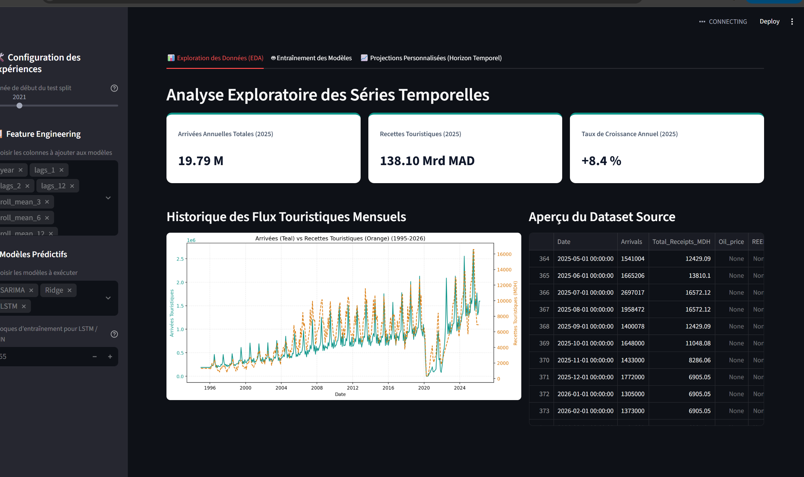

Applications Streamlit Interactives
=============================================================

Le projet fournit deux applications interactives basées sur **Streamlit** pour permettre aux utilisateurs d'interagir facilement avec le pipeline de données, d'ajuster les modèles prédictifs et d'effectuer des simulations financières autonomes.

.. contents:: Table des Matières
   :local:
   :depth: 2

1. Dashboard de Modélisation et Prévision (``streamlit_app.py``)
------------------------------------------------------------------

Le fichier ``streamlit_app.py`` est une application **Streamlit de modélisation et d'exploration** qui permet aux scientifiques des données et aux analystes d'expérimenter en temps réel avec le pipeline de Machine Learning.

   Interface de l'application de modélisation et prévision (``streamlit_app.py``) montrant le panneau de configuration des features et des modèles.

.. note::
   Pour lancer cette application, exécutez depuis la racine du projet :

   .. code-block:: bash

      streamlit run streamlit_app.py

   L'application sera accessible dans votre navigateur à l'adresse ``http://localhost:8501``.

Objectif et Fonctionnalités
~~~~~~~~~~~~~~~~~~~~~~~~~~~~

Cette application permet de simuler et configurer les paramètres clés de l'entraînement :

1. **Choix du Split Temporel** : L'utilisateur peut déplacer un slider pour définir l'année de début du split de test (par exemple, de 2020 à 2025). Les données antérieures servent à l'entraînement, tandis que les données postérieures valident la généralisation du modèle.
2. **Sélection des Caractéristiques (Feature Engineering)** : Sélection dynamique des variables explicatives parmi les lags (ex: ``lags_1``, ``lags_12``), les moyennes mobiles (ex: ``roll_mean_3``), les encodages cycliques (``month_sin``, ``month_cos``) et les variables événementielles (``cdm_event``, ``is_covid``).
3. **Sélection et Entraînement des Modèles** : L'utilisateur choisit les modèles à entraîner en temps réel (comme SARIMA, Ridge, LSTM).
4. **Nombre d'Époques de Deep Learning** : Configuration du nombre d'époques pour les modèles de Deep Learning (LSTM/RNN).
5. **Exploration Interactive des Données (EDA)** : Visualisation des séries historiques, de la décomposition saisonnière et de la table source.

.. warning::
   **Important : Pas de calcul de ROI**.
   Cette application est uniquement dédiée aux prévisions de séries temporelles (Arrivées ou Nuitées) et à la comparaison des métriques d'évaluation des modèles (R², RMSE, MAE, MAPE). Elle ne contient aucun module de simulation financière ou de calcul de ROI hôtelier. Ces calculs de rentabilité financière sont exclusifs à l'application web React et au simulateur autonome ``simulation.py``.

2. Simulateur ROI Hôtelier Autonome (``simulation.py``)
------------------------------------------------------------------

Le fichier ``simulation.py`` est une application **Streamlit autonome** dédiée à la simulation financière interactive d'investissements hôteliers sur 10 ans (2026-2035). Elle utilise directement les prévisions générées par les modèles prédictifs du projet.

.. note::
   Pour lancer cette application, exécutez depuis la racine du projet :

   .. code-block:: bash

      streamlit run simulation.py --server.port 8502

   L'application sera accessible dans votre navigateur à l'adresse ``http://localhost:8502``.

Objectif et Positionnement
~~~~~~~~~~~~~~~~~~~~~~~~~~~

Ce simulateur permet aux analystes et décideurs hôteliers de :

1. **Choisir la cible de prédiction** : Arrivées touristiques (``Arrivals``) OU Nuitées (``Nights``).
2. **Choisir une ville** parmi 6 métropoles marocaines stratégiques.
3. **Paramétrer un investissement hôtelier** (nombre de chambres, capex, ADR, occupation, WACC).
4. **Obtenir automatiquement les projections des Top 3 modèles** par cible, identifiés automatiquement à partir des fichiers de métriques CSV générés lors de l'entraînement.
5. **Comparer visuellement** les profils de rentabilité cumulée de chaque modèle sur 10 ans.
6. **Visualiser le RevPAR annuel** (Revenue Per Available Room) en mode Nuitées.
7. **Recevoir une recommandation d'investissement synthétique** basée sur les indicateurs NPV, IRR, Payback et ROI cumulé.

Sélecteur de Cible de Prediction
~~~~~~~~~~~~~~~~~~~~~~~~~~~~~~~~~

L'application expose un sélecteur unique qui change complètement le mode de simulation :

.. list-table::
   :header-rows: 1
   :widths: 20 80

   * - Mode
     - Comportement
   * - **Arrivées (Arrivals)**
     - Lit ``data/model_performance_metrics.csv`` pour identifier le Top 3. L'occupation hôtelière est déduite par le taux de croissance des arrivées par rapport à l'année de référence 2025 : ``Occ(t) = min(0.95, Occ_base x Arrivees_predites(t) / Arrivees_2025)``
   * - **Nuitées (Nights)**
     - Lit ``data/model_performance_metrics_nuitees.csv``. L'occupation est calculée directement et de façon plus précise : ``Occ(t) = min(0.95, Nuitees_predites(t) / (Chambres x 365))``. Un graphique **RevPAR annuel** supplémentaire est affiché : ``RevPAR = Occ x ADR``.

Paramètres Configurables (Barre Latérale)
~~~~~~~~~~~~~~~~~~~~~~~~~~~~~~~~~~~~~~~~~~

- **Variable à prédire** : Choix entre "Arrivées" et "Nuitées".
- **Ville Cible** : Choisi parmi 6 villes (Marrakech, Casablanca, Agadir, Tanger, Rabat, Fès).
- **Investissement (CapEx)** : Coût total de construction ou d'acquisition de l'hôtel (en Millions USD).
- **ADR Initial** : Tarif journalier moyen de départ (Average Daily Rate).
- **Nombre de Chambres** : Capacité totale de l'hôtel.
- **Taux d'Occupation de Base** : Taux d'occupation annuel hors événements exceptionnels.
- **WACC (Taux d'Actualisation)** : Coût Moyen Pondéré du Capital pour le calcul de la VAN (NPV).
- **Marge OpEx** : Part des coûts opérationnels dans le revenu total.
- **Taux d'Inflation Annuel** : Appliqué annuellement à l'ADR.
- **Boost ADR 2030 (Coupe du Monde)** : Augmentation spécifique de l'ADR en 2030 (+40% par défaut).

Calcul des Cash Flows et Indicateurs
~~~~~~~~~~~~~~~~~~~~~~~~~~~~~~~~~~~~~

Mode Arrivées (``simulate_with_forecast``)
  Le taux d'occupation suit la croissance relative des arrivées prédites :

  .. math::

     Occ(t) = \min(0.95, Occ_{base} \times \frac{Arrivées_{predites}(t)}{Arrivées_{2025}})

Mode Nuitées (``simulate_with_nuitees_forecast``)
  Le taux d'occupation est déduit directement des nuitées prédites :

  .. math::

     Occ(t) = \min(0.95, \frac{Nuitées_{predites}(t)}{Chambres \times 365})

  .. math::

     RevPAR(t) = Occ(t) \times ADR(t)

Dans les deux modes, la formule de revenus annuels est :

.. math::

   Revenu(t) = Chambres \times Occ(t) \times 365 \times ADR(t)

.. math::

   GOP(t) = Revenu(t) \times (1 - OpEx\_margin)

Les indicateurs financiers calculés sont :

- **NPV (VAN)** : Valeur Actuelle Nette. Somme actualisée des GOP annuels moins le CapEx. Une NPV positive indique un projet rentable.
- **IRR (TRI)** : Taux de Rentabilité Interne. Taux d'actualisation pour lequel la NPV s'annule.
- **Payback** : Délai de récupération de l'investissement initial (première année où le cash flow cumulé devient positif).
- **ROI Cumulé** : Retour sur investissement brut sur 10 ans.

Recommandation d'Expert Automatique
~~~~~~~~~~~~~~~~~~~~~~~~~~~~~~~~~~~~

Après la simulation, l'application génère automatiquement une note d'analyse basée sur le ROI maximal observé parmi les 3 modèles :

- **ROI >= 80%** : FAVORABLE (L'investissement est fortement recommandé).
- **40% <= ROI < 80%** : À ÉTUDIER (Acceptable, mais une analyse de sensibilité complémentaire est conseillée).
- **ROI < 40%** : DÉFAVORABLE (Le projet ne justifie pas le niveau de risque).
