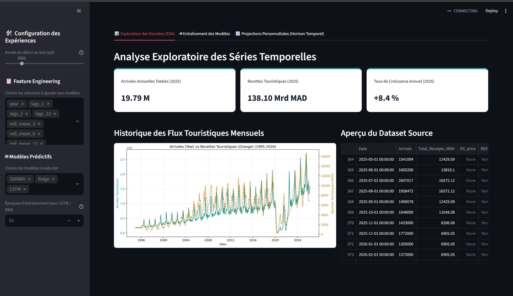

Application Streamlit de Simulation ROI (``simulation.py``)
=============================================================

Le fichier ``simulation.py`` est une application **Streamlit autonome** dédiée à la
simulation financière interactive d'investissements hôteliers sur 10 ans (2026-2035).
Contrairement au pipeline principal (``main.py``), cette application est entièrement
orientée utilisateur et ne nécessite aucune connaissance en programmation pour être utilisée.

   Vue générale de l'application Streamlit ``simulation.py`` après exécution d'une simulation comparée
   pour Marrakech avec les 3 modèles SARIMA, Ridge et LSTM.

.. note::
   Pour lancer l'application, exécutez depuis la racine du projet :

   .. code-block:: bash

      streamlit run simulation.py

   L'application sera accessible dans votre navigateur à ``http://localhost:8501``.

Objectif et Positionnement
---------------------------

Ce simulateur permet aux analystes et décideurs hôteliers de :

1. **Ofrire a l utilisatuer la capacite de choisire les parametre d entree.
2. **Choisir la date depuis il commence le test**.
3. **Avoir la capcite d essayer plusieur models de machine learning et deep learning.
4. **Comparer visuellement** les profils de rentabilité cumulée de chaque modèle sur 10 ans.

