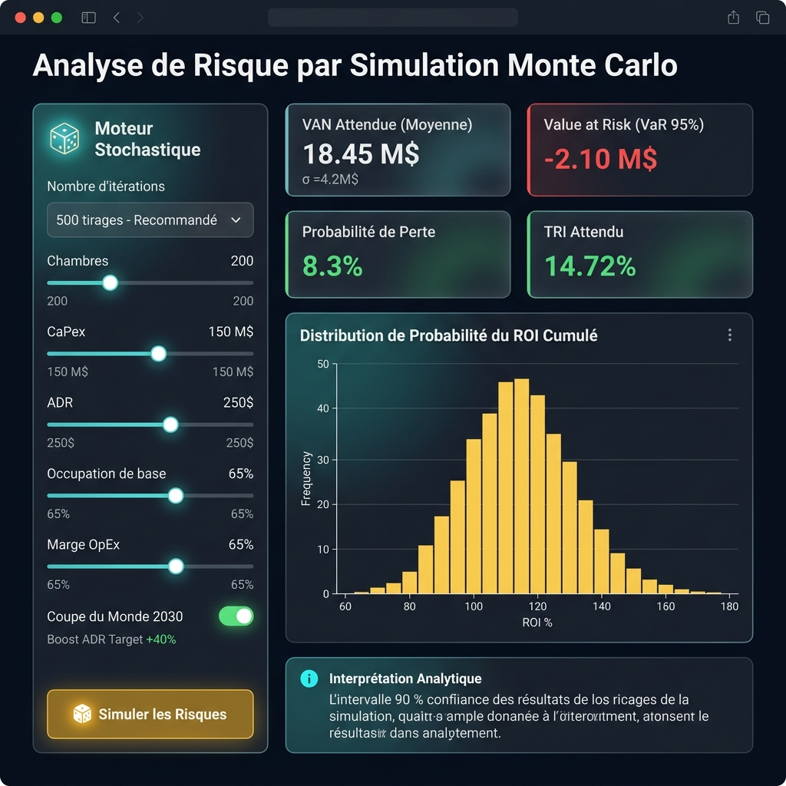

Plateforme Web Interactive Premium (React + FastAPI)
=====================================================

Le projet fournit une application web complète, moderne et premium
(**Morocco Tourism Investment Intelligence Platform**) divisée en un frontend React
monopage (SPA) propulsé par Vite et TailwindCSS, et un backend API en Python avec FastAPI.

Architecture de l'Application
--------------------------------

L'application est structurée en deux sous-dossiers à la racine :

* **backend/** : Contient le code serveur FastAPI (``backend/main.py``), les routeurs d'API
  (``backend/api/``) et le moteur de calcul scientifique et de simulation stochastique
  (``backend/src/``).
* **frontend/** : Contient l'application React monopage configurée avec TailwindCSS et
  Recharts pour les graphiques interactifs premium.

.. code-block:: text

   frontend/
   ├── src/
   │   ├── App.jsx              ← Routeur principal + navigation glassmorphism
   │   ├── main.jsx             ← Point d'entrée React
   │   ├── index.css            ← Variables CSS globales + animations
   │   └── pages/
   │       ├── Dashboard.jsx    ← Tableau de bord historique
   │       ├── Forecasting.jsx  ← Prévisions IA (Top 3 modèles)
   │       ├── RoiSimulator.jsx ← Simulateur ROI temps réel
   │       └── MonteCarlo.jsx   ← Analyse de risque stochastique

   backend/
   ├── main.py                  ← Serveur FastAPI + montage des routeurs
   └── api/
       ├── forecast.py          ← POST /api/forecast
       ├── roi.py               ← GET /api/roi/simulate
       └── monte_carlo.py       ← POST /api/monte-carlo/simulate

Lancement des Serveurs en Local
---------------------------------

1. Démarrer le Serveur API (Backend Python)
~~~~~~~~~~~~~~~~~~~~~~~~~~~~~~~~~~~~~~~~~~~~~

Le serveur FastAPI tourne par défaut sur ``http://127.0.0.1:8000``.

.. code-block:: bash

   python backend/main.py

La documentation interactive Swagger (OpenAPI) est accessible à ``http://localhost:8000/docs``.

2. Démarrer le Serveur de Développement Frontend (React + Vite)
~~~~~~~~~~~~~~~~~~~~~~~~~~~~~~~~~~~~~~~~~~~~~~~~~~~~~~~~~~~~~~~~~

Depuis la racine du projet :

.. code-block:: bash

   cd frontend
   npm run dev

L'application web est accessible dans le navigateur à ``http://localhost:5173``.
Toutes les requêtes vers ``/api/*`` sont automatiquement redirigées vers le backend
local via un reverse-proxy configuré dans ``vite.config.js``.

Structure des Pages de la Plateforme
--------------------------------------

Tableau de Bord (Dashboard)
~~~~~~~~~~~~~~~~~~~~~~~~~~~~~

- Métriques de synthèse des flux touristiques et financiers par ville hôte.
- Graphiques historiques interactifs combinant arrivées et recettes réelles.
- Référentiel hôtelier par défaut pour 6 villes stratégiques marocaines.

Previsions IA (Forecasting)
~~~~~~~~~~~~~~~~~~~~~~~~~~~~~

- Choix de la **cible de prediction** : Arrivees touristiques (``Arrivals``) ou Nuitees (``Nights``).
- Identification automatique du **Top 3 modeles** par cible, lu depuis le fichier de metriques CSV
  correspondant (``model_performance_metrics.csv`` ou ``model_performance_metrics_nuitees.csv``).
- Evaluation historique comparative sur l'ensemble de test (2023-2026).
- Projections futures personnalisables jusqu'en 2035 avec inflation et boost FIFA 2030.
- Exportation des resultats de prevision au format CSV.

Simulateur ROI Hotelier (RoiSimulator)
~~~~~~~~~~~~~~~~~~~~~~~~~~~~~~~~~~~~~~~~~

- Parametrage financier complet par sliders en temps reel (chambres, investissement, ADR,
  occupation, WACC).
- Comparaison dynamique entre le scenario de base et le scenario Coupe du Monde 2030.
- **Mode Nuitees** : affiche le graphique **RevPAR annuel** (Revenue Per Available Room)
  calcule directement depuis les nuitees predites : ``Occ = Nuitees / (Chambres x 365)``.
- Tableau de cash flows financiers sur 10 ans exportable en CSV.

Simulation Monte Carlo (Analyse de Risque)
~~~~~~~~~~~~~~~~~~~~~~~~~~~~~~~~~~~~~~~~~~~~

Voir la section dediee :ref:`monte_carlo_section` ci-dessous pour la documentation
complete de la page Monte Carlo.

.. _monte_carlo_section:

Simulation Monte Carlo — Analyse Probabiliste de Risque
---------------------------------------------------------

   Page **Simulation Monte Carlo** de la plateforme React. À gauche : le panneau de
   contrôle stochastique. À droite : les 4 indicateurs de risque clés et la distribution
   de probabilité du ROI sur les scénarios simulés.

Qu'est-ce que la simulation Monte Carlo ?
~~~~~~~~~~~~~~~~~~~~~~~~~~~~~~~~~~~~~~~~~~~

La **méthode de Monte Carlo** est une technique de simulation probabiliste qui consiste à
répéter un grand nombre de fois un calcul (ici, la rentabilité d'un hôtel) en faisant
**varier aléatoirement** les paramètres incertains autour de leurs valeurs supposées.
L'ensemble des résultats forme une **distribution de probabilité** qui quantifie
l'incertitude et le risque du projet.

Dans le contexte de cet outil, au lieu de calculer une seule NPV avec des paramètres
fixes, on calcule **200 à 1000 NPV différentes**, chacune tirée avec des paramètres
légèrement différents (inflation, occupation, boost Coupe du Monde) selon des lois
probabilistes calibrées. Cela permet de répondre à la question :

   *"Quelle est la probabilité que cet investissement hôtelier soit rentable ?"*

Paramètres Stochastiques du Moteur
~~~~~~~~~~~~~~~~~~~~~~~~~~~~~~~~~~~~

La page expose les paramètres suivants dans son panneau de contrôle gauche :

.. list-table::
   :header-rows: 1
   :widths: 25 15 15 45

   * - Paramètre
     - Unité
     - Défaut
     - Description
   * - **Nombre d'itérations**
     - Tirages
     - 500
     - Nombre de scénarios simulés. 200 = rapide, 500 = recommandé, 1000 = précis.
   * - **Chambres**
     - Unité
     - 200
     - Capacité totale de l'hôtel (paramètre fixe entre simulations).
   * - **CapEx**
     - Millions USD
     - 150
     - Investissement initial (fixe entre simulations).
   * - **ADR**
     - USD / nuit
     - 250
     - Tarif journalier moyen de départ (fixe ; l'inflation est simulée aléatoirement).
   * - **Occupation de base**
     - %
     - 65%
     - Valeur centrale du taux d'occupation. Variabilité simulée avec σ = ±3%.
   * - **Marge OpEx**
     - %
     - 65%
     - Valeur centrale des coûts opérationnels. Variabilité simulée avec σ = ±2%.
   * - **Coupe du Monde 2030**
     - Booléen
     - Activé
     - Active un boost aléatoire suivant une **loi triangulaire** autour de la valeur cible.
   * - **Boost ADR Target**
     - %
     - +40%
     - Valeur modale du boost ADR en 2030. Loi triangulaire : [boost−15%, boost, boost+20%].

Distributions Probabilistes Utilisées
~~~~~~~~~~~~~~~~~~~~~~~~~~~~~~~~~~~~~~~

Chaque itération tire ses paramètres selon ces distributions :

.. code-block:: python

   # Inflation : loi normale centree sur la valeur saisie
   sampled_inflation  = N(inflation_rate, std=0.005)

   # Occupation : loi normale centree sur la valeur saisie
   sampled_occupancy  = N(base_occupancy, std=0.03)

   # Marge OpEx : loi normale centree sur la valeur saisie
   sampled_opex       = N(opex_margin, std=0.02)

   # Boost ADR Coupe du Monde : loi triangulaire (asymetrique)
   sampled_wc_adr     = Triangulaire(left=boost-15%, mode=boost, right=boost+20%)

L'utilisation d'une **loi triangulaire** pour le boost FIFA 2030 est justifiée par la
nature de cet événement : le meilleur scénario (côté droit de la distribution, +20% au-delà
de l'objectif) est plus étendu que le pire scénario (−15%), reflétant l'asymétrie positive
attendue d'un événement sportif mondial.

Indicateurs de Risque Calculés
~~~~~~~~~~~~~~~~~~~~~~~~~~~~~~~~

À l'issue des simulations, 4 indicateurs clés sont affichés sous forme de cards :

.. list-table::
   :header-rows: 1
   :widths: 30 70

   * - Indicateur
     - Signification
   * - **VAN Attendue** (NPV moyenne ± σ)
     - La valeur actualisée nette moyenne sur tous les scénarios. L'écart-type σ mesure
       la dispersion : un σ élevé indique un risque important.
   * - **Value at Risk — VaR 95%**
     - Le **5ème percentile** de la distribution des NPV. Interprétation : *"Dans 95% des
       scénarios, la VAN sera supérieure à ce seuil"*. Si négatif, le projet présente un
       risque de perte significatif dans les scénarios défavorables.
   * - **Probabilité de Perte** P(NPV < 0)
     - Pourcentage des scénarios où la VAN est négative. Une valeur ≤ 10% est généralement
       acceptable pour un investissement hôtelier.
   * - **TRI Attendu** (IRR moyen)
     - Taux de rentabilité interne moyen sur tous les scénarios. À comparer au WACC saisi :
       TRI > WACC signifie une création de valeur en espérance.

Distribution de Probabilité du ROI
~~~~~~~~~~~~~~~~~~~~~~~~~~~~~~~~~~~~~~

Le graphique en barres (histogramme) affiche la **distribution de fréquences du ROI cumulé**
sur les N scénarios simulés. Chaque barre représente un intervalle de ROI (exprimé en %)
et sa hauteur donne le nombre de scénarios tombant dans cet intervalle.

Un profil de distribution idéal est :

- **Centré vers la droite** (ROI médian élevé)
- **Peu étalé** (faible volatilité)
- **Asymétrie positive** (queue droite plus longue que la gauche)

L'encadré **Interprétation Analytique** sous le graphique affiche automatiquement
l'intervalle de confiance à 90% du ROI (5ème − 95ème percentile) et rappelle la VaR 95%.

Exemple d'Interprétation
~~~~~~~~~~~~~~~~~~~~~~~~~~

Pour un hôtel de 200 chambres à Marrakech avec CapEx = 150 M$ et 500 itérations :

.. code-block:: text

   VAN Attendue : 18.45 M$ (σ = 4.2 M$)
   VaR 95%      : -2.10 M$          ← Dans 5% des cas, on peut perdre jusqu'à 2.1 M$
   P(Perte)     : 8.3%              ← Probabilité de NPV négative
   TRI Attendu  : 14.72%            ← Supérieur au WACC de 8% → projet créateur de valeur
   IC 90% ROI   : [72.4% ; 148.6%] ← Fourchette probable du retour sur 10 ans

Ce résultat indique un projet **favorable** : la probabilité de perte est contenue à 8%,
et le TRI attendu est largement supérieur au coût du capital.

Architecture Technique de la Web App
--------------------------------------

La plateforme interactive utilise une architecture web moderne à services découplés :

1. **Frontend (Single Page Application)**

   - Propulsé par **React 18** et **Vite** pour un temps de chargement ultra-rapide.
   - Design moderne premium reposant sur le *Glassmorphism* avec un thème sombre élégant.
   - Graphiques réactifs et interactifs dessinés avec **Recharts**.
   - Navigation côté client via React Router (sans rechargement de page).

2. **Backend (API REST asynchrone)**

   - Construit en Python avec **FastAPI**, assurant une vitesse d'execution optimale.
   - Validation stricte des requetes par type via **Pydantic**.
   - Moteur mathematique et financier asynchrone pour les projections recursives et
     le generateur Monte Carlo (``numpy`` + ``HotelROISimulator``).

.. list-table:: Endpoints de l'API Backend
   :header-rows: 1
   :widths: 10 30 60

   * - Methode
     - Route
     - Description
   * - GET
     - ``/api/forecast/models``
     - Retourne la liste des modeles disponibles (SARIMA, Ridge, LSTM, etc.).
   * - GET
     - ``/api/forecast/features``
     - Retourne la liste des 36 features Arrivees (``get_feature_list()``).
   * - GET
     - ``/api/forecast/features/nights``
     - Retourne la liste des 49 features Nuitees (``get_nights_feature_list()``).
   * - POST
     - ``/api/forecast/metrics``
     - Calcule les metriques (R2, RMSE, MAE, MAPE) des modeles selectionnes sur l'ensemble de test.
   * - POST
     - ``/api/forecast``
     - Lance une prevision recursive avec le modele selectionne pour la cible choisie
       (``target_col`` : ``Arrivals`` ou ``Nights``). Retourne les predictions 2026-2035.
   * - GET
     - ``/api/roi/simulate``
     - Calcule le tableau de cash flows et les indicateurs NPV, IRR, Payback sur 10 ans
       (mode Arrivees). Utilise ``simulate_with_forecast()``.
   * - GET
     - ``/api/roi/simulate/nights``
     - Calcule les cash flows avec occupation directe depuis les nuitees predites.
       Retourne egalement le RevPAR annuel. Utilise ``simulate_with_nuitees_forecast()``.
   * - POST
     - ``/api/monte-carlo/simulate``
     - Lance N simulations Monte Carlo et retourne le sommaire statistique (VAN esperee,
       VaR 95%, P(perte), TRI) et l'histogramme du ROI.
